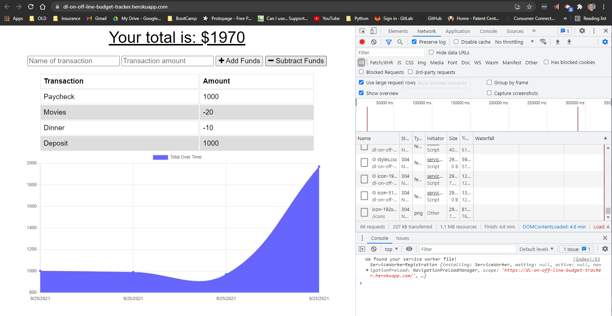
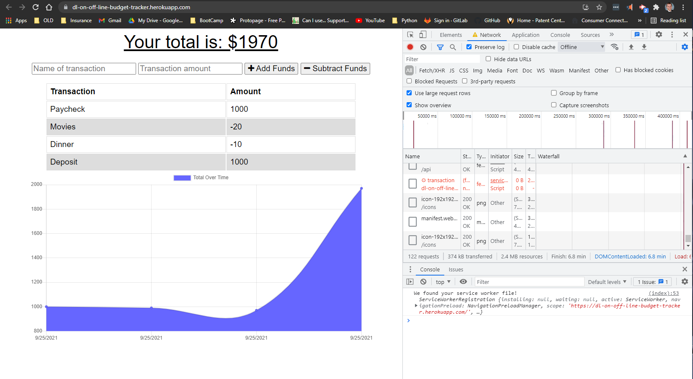
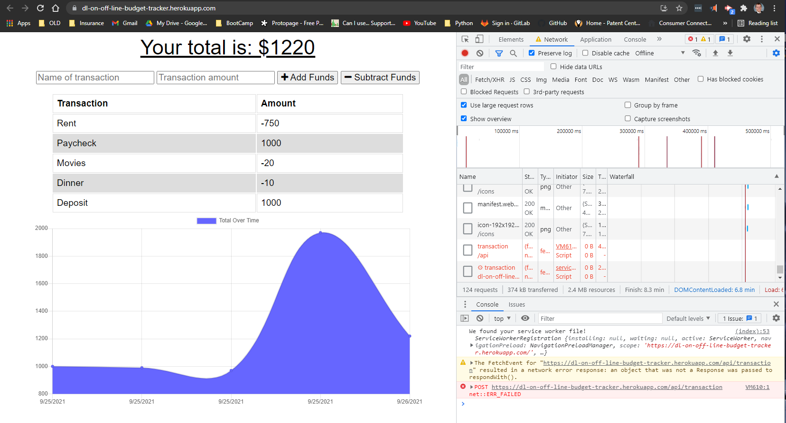

# Unit 19 PWA Homework: Online/Offline Budget Trackers

## Your Task

The task for this project was to add offline/online functionality to an existing application. While online, this application is able to create transactions and save the information in a database. Once offline, the website remains functional with the ability to locally store transactions and to update the database when reconnected to the internet.

The acceptance criteria are as follows below.

## Acceptance Criteria

```md
GIVEN a user is on Budget App without an internet connection
    WHEN the user inputs a withdrawal or deposit
        THEN that will be shown on the page, and added to their transaction history when their connection is back online.
```

Heroku: https://dl-on-off-line-budget-tracker.herokuapp.com/
GitHub: https://github.com/D-Loot/W19-OnlineOfflineBudgetTracker

## Screenshots:



Here is the application while it is connected to the internet. The required files are downloaded to the indexedDB for later use when the user is offline.


The application is now able to be re-loaded even when there is no internet connection.


You are able to submit a transaction and store the information on your device to later update the database.


The user is back online and the database is now up to date.

# Background

## Your Task

# Unit 19 PWA Homework: Online/Offline Budget Trackers

Add functionality to our existing Budget Tracker application to allow for offline access and functionality.

The user will be able to add expenses and deposits to their budget with or without a connection. When entering transactions offline, they should populate the total when brought back online.

Offline Functionality:

  * Enter deposits offline

  * Enter expenses offline

When brought back online:

  * Offline entries should be added to tracker.

## User Story
AS AN avid traveller
I WANT to be able to track my withdrawals and deposits with or without a data/internet connection
SO THAT my account balance is accurate when I am traveling

## Business Context

Giving users a fast and easy way to track their money is important, but allowing them to access that information anytime is even more important. Having offline functionality is paramount to our applications success.


## Acceptance Criteria
GIVEN a user is on Budget App without an internet connection
WHEN the user inputs a withdrawal or deposit
THEN that will be shown on the page, and added to their transaction history when their connection is back online.

- - -

## Commit Early and Often

* One of the most important skills to master as a web developer is version control. Building the habit of committing via Git is important for two reasons:

1. Your commit history is a signal to employers that you are actively working on projects and learning new skills

2. Your commit history allows you to revert your code base in the event that you need to return to a previous state

* Follow these guidelines for committing:

  * Make single purpose commits for related changes to ensure a clean, manageable history. If you are fixing two issues, make two commits

  * Write descriptive, meaningful commit messages so that you and anyone else looking at your repository can easily understand its history

  * Don't commit half done work, for the sake of your collaborators (and your future self!)

  * Test your application before you commit to ensure functionality at every step in the development process

* We would like you to have well over 200 commits by graduation, so commit early and often!

* Deploy your application with [Heroku and MongoDB Atlas.](../04-Important/MongoAtlas-Deploy.md)

## Submission on BCS

* You are required to submit the following:

  * the URL to the deployed application

  * the URL to the Github repository

- - -

## Hint

* In order to cache dynamic content, i.e. users' inputs for withdrawals or deposits, incorporate `indexedDB` from the previous module.

* Use [Google](https://www.google.com) or another search engine to research this topic.